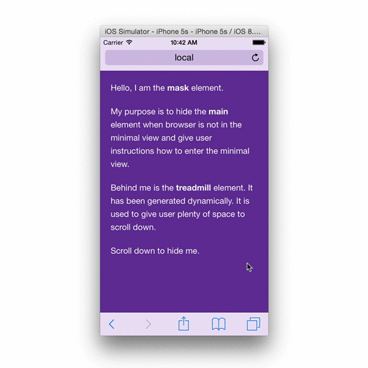

# Brim

[](http://badge.fury.io/js/brim)
[](http://badge.fury.io/bo/brim)

View ([minimal-ui](#minimal-ui)) manager for iOS 8.



## Contents

- [minimal-ui](#minimalui)
- [The Underlying Implementation](#the-underlying-implementation)
- [Quick Start](#quick-start)
- [Styling](#styling)
- [Events](#events)
    - [`viewchange`](#viewchange)
- [Detecting iOS 8](#detecting-ios-)
- [Download](#download)


## minimal-ui

In [iOS 7.1](https://developer.apple.com/library/ios/releasenotes/General/RN-iOSSDK-7.1/index.html), a property, minimal-ui, has been added for the viewport meta tag key that allows minimizing the top and bottom bars in Safari as the page loads. While on a page using minimal-ui, tapping the top bar brings the bars back. Tapping back in the content dismisses them again.

The minimal-ui viewport property is [no longer supported](https://developer.apple.com/library/ios/releasenotes/General/RN-iOSSDK-8.0/) in iOS 8. However, the minimal-ui itself is not gone. User can enter the minimal-ui with a "touch-drag down" gesture.

There are several pre-conditions and obstacles to manage the view state, e.g. for minimal-ui to work, there has to be enough content to enable user to scroll; for minimal-ui to persist, window scroll must be offset on page load and after orientation change. Furthermore, [there is no way of calculating the dimensions of the minimal-ui](http://stackoverflow.com/questions/26801943/how-to-get-the-window-size-of-fullscreen-view-when-not-in-fullscreen) using the `screen` variable, and thus no way of telling when user is in the minimal-ui in advance.

* Brim solves all of the issues associated with determining when user is in the minimal-ui
* It provides control over the UI required to instruct user to enter the minimal-ui.
* It locks user in the minimal-ui (following the spec defined in the iOS 7.1).
* It makes the minimal-ui persist.
* It does not jeopardize functionality of the main application.

## The Underlying Implementation

There are three element required to make Brim work:

* Treadmill. Treadmill element is used to give user space to scroll. The element is dynamically created without you having to do anything. It is invisible to the user the entire time. This element has ID `brim-treadmill`.
* Mask element. It is displayed to the user when device is not in the minimal-ui state. The role of the element is to instruct user to enter the minimal-ui. You have to have this element as a direct descendant of `<body>`. It has to have ID `brim-mask` and no styling that would affect the position or the dimensions of the element.
* Main element. This element is shown when mask is hidden. You have to have this element as a direct descendant of `<body>`. It has to have ID `brim-main` and no styling that would affect the position or the dimensions of the element.

When page is loaded, Brim will create a treadmill. The role of treadmill is to make sure that the page content height is always greater than the viewport height. This ensures that user can enter the viewport and viewport continues to persist if you reload the page.

Upon loading the page or after changing the orientation, Brim is using [Scream](https://github.com/gajus/scream) (developed as part of this project) to detect if page is in the minimal-ui view (page that has been previously in minimal-ui and has been reloaded will remain in the minimal-ui if content height is greater than the viewport height).

For documentation purposes it is worth noting that you cannot use Scream to detect if device is in minimal-ui straight after the [orientationchange](https://developer.mozilla.org/en-US/docs/Web/Events/orientationchange) event because `window` dimensions do not reflect the new orientation until the rotation animation has ended. You have to attach a listener to the [orientationchangeend](https://github.com/gajus/orientationchangeend) (developed as part of this project) event.

When page is in the minimal-ui, Brim will disable scrolling of the document (it does this in a [safe way](http://stackoverflow.com/a/26853900/368691) that does not affect the contents of the main element). Disabling document scrolling prevents accidentally leaving the minimal-ui when scrolling upwards. As per the original iOS 7.1 spec, tapping the top bar brings back the rest of the chrome.

When page is in the full view, Brim will show the mask element.

## Quick Start

```html
<!DOCTYPE html>
<html>
<head>
    <script src="./bower_components/scream/dist/scream.js"></script>
    <script src="./bower_components/brim/dist/brim.js"></script>
    <script>
    window.addEventListener('DOMContentLoaded', function () {
        var scream,
            brim;

        scream = gajus.Scream({
            width: {
                portrait: 320,
                landscape: 640
            }
        });

        brim = gajus.Brim({
            viewport: scream
        });
    });
    </script>
</head>
<body>
    <div id="brim-mask">
        <!-- Content displayed to the user when in full view. -->
    </div>
    <div id="brim-main">
        <!-- Content displayed to the user when in minimal view.  -->
    </div>
</body>
</html>
```

## Styling

If mask element does not have active content, it is advisable to disable pointer events:

```css
#brim-mask {
    pointer-events: none;
}
```

Do not set style that would change position or dimensions of the mask or the main element.

Do not style the treadmill.

## Events

### `viewchange`

Invoked on page load and when view changes.

```js
brim.on('viewchange', function (e) {
    // Invoked when view changes.

    // @var {String} 'full', 'minimal'
    e.viewName;
});
```

## Detecting iOS 8

Brim does not have a use case outside of iOS 8, though it does not restrict itself.

I recommend using [platform.js](https://github.com/bestiejs/platform.js/) to target and apply Brim.

```js
// ...
```

## Download

Using [Bower](http://bower.io/):

```sh
bower install brim
```

Using [NPM](https://www.npmjs.org/):

```sh
npm install brim
```

The old-fashioned way, download either of the following files:

* https://raw.githubusercontent.com/gajus/brim/master/dist/brim.js
* https://raw.githubusercontent.com/gajus/brim/master/dist/brim.min.js
